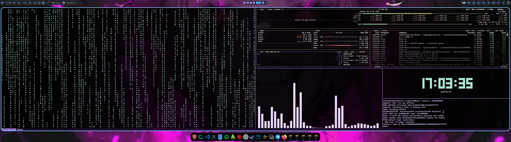

<p align="center">
  
  
  
  
</p>

<h1 align="center">
  🎨 fastfetch-themes-mt3k
</h1>

<p align="center">
  <strong>A curated collection of 54+ stunning themes for <a href="https://github.com/fastfetch-cli/fastfetch">fastfetch</a></strong><br>
  <sub>Fork of <a href="https://github.com/m3tozz/FastCat">FastCat</a> — reimagined with a unified, feature-rich theme selector</sub>
</p>

<p align="center">
  <a href="#-quick-start">Quick Start</a> •
  <a href="#-features">Features</a> •
  <a href="#-theme-gallery">Gallery</a> •
  <a href="#-usage">Usage</a> •
  <a href="#-adding-themes">Add Themes</a> •
  <a href="#-credits">Credits</a>
</p>

---

## ⚡ Quick Start

<table>
<tr>
<td width="50%">

### 🐧 Linux / macOS

```bash
git clone https://github.com/MondoBoricua/fastfetch-themes-mt3k.git
cd fastfetch-themes-mt3k
chmod +x fastfetch-themes-mt3k
./fastfetch-themes-mt3k
```

</td>
<td width="50%">

### 🪟 Windows (PowerShell)

```powershell
git clone https://github.com/MondoBoricua/fastfetch-themes-mt3k.git
cd fastfetch-themes-mt3k
.\fastfetch-themes-mt3k.ps1
```

</td>
</tr>
</table>

> [!TIP]
> Don't have fastfetch installed? No worries — the script auto-detects and offers to install it for you! 🚀

> [!IMPORTANT]
> **Windows users:** Visual themes need `chafa` when using Windows Terminal. Select the `chafa` protocol when applying a Visual theme. The PowerShell script will try to install `chafa` automatically if it is missing.

---

## ✨ Features

<table>
<tr>
<td>

### 🎯 Core

- 🖼️ **54+ themes** across 3 categories
- 🔍 **Auto-detection** of all themes
- 📦 **Single script** replaces multiple originals
- 🖥️ **Cross-platform** — Linux, macOS, Windows

</td>
<td>

### 🛡️ Management

- 💾 **Backup & Restore** with auto-prune (max 5)
- ⭐ **Favorites** system
- 📜 **History** — last 10 applied themes
- ✅ **JSON validation** before applying

</td>
</tr>
<tr>
<td>

### 🔮 Discovery

- 👁️ **Preview mode** — test without changes
- 🎲 **Random theme** by category
- 🔎 **Search** themes by name
- 🎬 **Slideshow** — auto-preview all themes

</td>
<td>

### 🔧 Tools

- 🔤 **Nerd Fonts installer** (7 popular fonts)
- 🖥️ **Visual terminal installer** — WezTerm, winghostty, chafa
- 🐚 **Shell auto-start** setup
- 💀 **Hacker Mode** — terminal hacker layout
- 🔔 **Desktop notifications**

</td>
</tr>
</table>

### 🖥️ CLI Mode

Skip the interactive menu and use directly from the command line:

```bash
./fastfetch-themes-mt3k --apply "Hacker"        # Apply theme by name
./fastfetch-themes-mt3k --preview "Toga-Himiko"  # Preview without applying
./fastfetch-themes-mt3k --random                 # Apply random theme
./fastfetch-themes-mt3k --random visual          # Random from category
./fastfetch-themes-mt3k --list                   # List all themes
./fastfetch-themes-mt3k --search "hack"          # Search themes
./fastfetch-themes-mt3k --update                 # Pull updates from git
./fastfetch-themes-mt3k --favorites              # Show favorites
./fastfetch-themes-mt3k --history                # Show history
./fastfetch-themes-mt3k --version                # Show version
./fastfetch-themes-mt3k --help                   # Show help
```

---

## 🎨 Theme Gallery

### 🔴 Large Themes — _ASCII art logos (big & bold)_

<table>
<tr>
<td>

| #   | Theme               | #   | Theme        |
| --- | ------------------- | --- | ------------ |
| 1   | Anime-Boy           | 17  | Rose         |
| 2   | Anime-Girl          | 18  | Saturn       |
| 3   | Arch                | 19  | Scorpion     |
| 4   | Arthur-Morgan's-hat | 20  | Shiraz-Linux |
| 5   | BatMan              | 21  | ShirazTux    |
| 6   | Cat                 | 22  | Simpsons     |
| 7   | catCouple           | 23  | Spider-Man   |
| 8   | DeadPool            | 24  | Stars        |
| 9   | Death               | 25  | Superman     |
| 10  | Fedora              | 26  | Suse-Icons   |
| 11  | Groups              | 27  | TheLead      |
| 12  | Home                | 28  | Triangle     |
| 13  | Hyprland            | 29  | Yandere-Girl |
| 14  | Jurassic            | 30  | —            |
| 15  | Kaviani-Derafsh     | 31  | —            |
| 16  | MetoCat             | —   | —            |

</td>
</tr>
</table>

### 🟢 Small Themes — _ASCII art logos (compact & clean)_

> Bunny • Cat • Cocktail • Coffee • Duck • Fast-Snail • Giraffe • OWL • Palm • Robo-Dog • Sheriff • Tie-Fighter • Arch • Blocks • MetoSpace • Minimal

### 🟠 Visual Themes — _Image-based logos (require image protocol)_

> Dragonball • Hacker • Hacker (Mac) • One-Piece • PikachuCoder • Toga-Himiko • Xenia

---

## 🕹️ Usage

### Interactive Controls

Launch the interactive menu and use these keys:

|  Key  | Action                 | Key | Action                |
| :---: | ---------------------- | :-: | --------------------- |
| `1-N` | Select theme by number | `v` | ⭐ Favorites menu     |
|  `b`  | 💾 Backup config       | `+` | ⭐ Toggle favorite    |
|  `r`  | ♻️ Restore backup      | `h` | 📜 Show history       |
|  `p`  | 👁️ Preview theme       | `c` | 🏷️ Filter by category |
|  `d`  | 🎲 Random theme        | `w` | 🎬 Slideshow mode     |
|  `/`  | 🔎 Search themes       | `i` | ℹ️ Theme info         |
|  `f`  | 🔤 Install Nerd Fonts  | `u` | 🔄 Update themes      |
|  `k`  | 🖥️ Install terminal    | `s` | 🐚 Shell auto-start   |
|  `m`  | 💀 Hacker Mode         | `x` | 🚪 Exit               |

---

<details>
<summary><h3>🖼️ Image Protocols (Visual Themes)</h3></summary>

When selecting a Visual theme, choose your image rendering protocol:

| Protocol       | Best For      | Terminals                      |
| -------------- | ------------- | ------------------------------ |
| `auto`         | 🟢 Most users | Kitty, Ghostty _(auto-detect)_ |
| `kitty`        | Standard      | Kitty                          |
| `kitty-direct` | ⚡ Fastest    | WezTerm, Warp, Kitty, Ghostty  |
| `iterm`        | macOS         | iTerm2, WezTerm, Konsole       |
| `sixel`        | Legacy        | foot, Contour                  |
| `chafa`        | Windows       | Windows Terminal fallback      |

> [!NOTE]
> On Windows Terminal, use `chafa` for Visual themes. Windows Terminal does not reliably render the native image protocols used by fastfetch Visual themes. `chafa` converts the image to ANSI/terminal art so it works in a normal PowerShell session.

PowerShell example:

```powershell
.\fastfetch-themes-mt3k.ps1 apply PikachuCoder chafa
```

</details>

<details>
<summary><h3>🔤 Nerd Fonts Installer</h3></summary>

Download and install popular Nerd Fonts with a single keypress:

| Font              | Style                             |
| ----------------- | --------------------------------- |
| **JetBrainsMono** | ✨ Clean & modern _(recommended)_ |
| **Meslo**         | 📟 Classic, Powerlevel10k default |
| **FiraCode**      | 🔗 Popular ligature font          |
| **Hack**          | ⚡ Minimal and sharp              |
| **CascadiaCode**  | 🪟 Microsoft's modern font        |
| **UbuntuMono**    | 🐧 Ubuntu's default mono          |
| **SourceCodePro** | 🎨 Adobe's coding font            |

> Install all 7 at once with the `[a]` option!

</details>

<details>
<summary><h3>🖥️ Visual Terminal Installer</h3></summary>

Install helpers or terminals for Visual theme support:

**Linux/macOS:**

- Use a terminal that supports image protocols, such as Kitty, WezTerm, Ghostty, iTerm2, or a Sixel-capable terminal.

**Windows:**

- `chafa` via winget/choco/scoop — recommended fallback for Windows Terminal
- WezTerm via winget
- WezTerm nightly via winget
- winghostty via winget

> [!IMPORTANT]
> Kitty is not provided as a normal Windows terminal option here, and Warp is not recommended for these Visual themes. If you are staying in Windows Terminal, use `chafa`.

</details>

<details>
<summary><h3>💀 Hacker Mode</h3></summary>

Install a terminal hacker layout with Kitty splits — cmatrix, btop, cava, tty-clock, genact, and pipes.sh all running simultaneously:

<p align="center">
  
</p>

```
┌──────────────┬──────────────┐
│              │              │
│              │    btop      │
│              │              │
│   cmatrix    ├───────┬──────┤
│              │       │clock │
│              │ cava  ├──────┤
│              │       │genact│
└──────────────┴───────┴──────┘
```

**Dependencies auto-installed** via your package manager (pacman, apt, dnf, brew):

| Program | What it does |
|---------|-------------|
| `cmatrix` | Matrix digital rain |
| `btop` | System monitor |
| `cava` | Audio visualizer |
| `tty-clock` | ASCII clock |
| `genact` | Fake hacker activity |
| `pipes.sh` | Animated pipes |

**Usage after install:**

```bash
hacker-mode        # Normal window
hacker-mode --full # Fullscreen
```

> Requires [Kitty](https://sw.kovidgoyal.net/kitty/) terminal. On Windows, `[k]` installs Visual theme helpers instead; Hacker Mode is mainly intended for Linux/macOS terminals with Kitty available.

</details>

<details>
<summary><h3>🐚 Shell Auto-Start</h3></summary>

Run fastfetch automatically when you open a terminal:

| Shell          | Config File                  |
| -------------- | ---------------------------- |
| **Bash**       | `~/.bashrc`                  |
| **Zsh**        | `~/.zshrc`                   |
| **Fish**       | `~/.config/fish/config.fish` |
| **PowerShell** | Windows profile              |
| **Git Bash**   | Windows `~/.bashrc`          |

> 💡 Run the option again to remove auto-start.

</details>

---

## 🧩 Adding Themes

The script **auto-detects** new themes — no code changes needed. Just drop a folder:

```
YourTheme/
└── fastfetch/
    ├── config.jsonc          # Required: fastfetch configuration
    └── logo.txt              # ASCII art (Large/Small themes)
    └── image.png             # Or image file (Visual themes)
```

Place it in the right category:

| Folder            | Type             | Logo                     |
| ----------------- | ---------------- | ------------------------ |
| `Large-Themes/`   | 🔴 Big ASCII art | `logo.txt` / `ascii.txt` |
| `Small-Themes/`   | 🟢 Compact ASCII | `logo.txt` / `ascii.txt` |
| `Visuals-Themes/` | 🟠 Image-based   | `.png` / `.jpg`          |

Then just run the script — your theme appears in the menu automatically! ✨

---

## 📋 Requirements

| Requirement                                             | Status            | Notes                                      |
| ------------------------------------------------------- | ----------------- | ------------------------------------------ |
| [fastfetch](https://github.com/fastfetch-cli/fastfetch) | Auto-installed    | Core dependency                            |
| Bash / PowerShell                                       | Required          | Bash (Linux/macOS) or PowerShell (Windows) |
| [Nerd Fonts](https://www.nerdfonts.com/)                | Optional          | Installable via `[f]` option               |
| Image-capable terminal                                  | For Visual themes | Use `chafa` on Windows Terminal; terminal options via `[k]` |
| [chafa](https://hpjansson.org/chafa/)                   | Windows Visual themes | Auto-installed when selecting `chafa`      |

---

## 🏗️ Project Structure

```
fastfetch-themes-mt3k/
├── 📜 fastfetch-themes-mt3k        # Bash script (Linux/macOS)
├── 📜 fastfetch-themes-mt3k.ps1    # PowerShell script (Windows)
├── 🔴 Large-Themes/                # 31 themes — big ASCII art
│   ├── Anime-Boy/
│   ├── BatMan/
│   ├── DeadPool/
│   └── ...
├── 🟢 Small-Themes/                # 16 themes — compact ASCII
│   ├── Bunny/
│   ├── Coffee/
│   ├── OWL/
│   └── ...
├── 🟠 Visuals-Themes/              # 7 themes — image-based
│   ├── Hacker/                     # 🌟 Custom theme by mt3k
│   ├── Dragonball/
│   ├── Toga-Himiko/
│   └── ...
├── 📄 README.md
└── 📄 LICENSE
```

---

## 🙏 Credits

|                         |                                                                                     |
| ----------------------- | ----------------------------------------------------------------------------------- |
| 🏠 **Original Project** | [FastCat](https://github.com/m3tozz/FastCat) by [m3tozz](https://github.com/m3tozz) |
| 🎨 **Hacker Theme**     | Custom design by [mt3k](https://github.com/MondoBoricua)                            |
| 🚀 **fastfetch**        | [fastfetch-cli](https://github.com/fastfetch-cli/fastfetch)                         |

---

## 📄 License

This project is licensed under the **MIT License** — see the [LICENSE](LICENSE) file for details.

---

<p align="center">
  <sub>Made with ❤️ by <a href="https://github.com/MondoBoricua">MondoBoricua</a></sub><br>
  <sub>⭐ Star this repo if you like it!</sub>
</p>
